---

layout: post
title: "AWS SA-A review - domain knowledge"
subtitle: ""
date: 2020-06-01 00:00:00
author: "Jason Denn"
header-img: "img/post-bg-2015.jpg"
catalog: true
tags:
  - infrastructure
  - AWS
  - Certification
---

## IAM

> Identity Access Management


#### Role with EC2 

##### Example

1. SSH to an new EC2 instance
2. try `aws s3 ls`. It will request you to configure credentials by running `aws configure` so that you can input your Access Key ID and Secret there. Don't do it but follow step 3.
3. Go to attach a admin role to this EC2 instance, then try step 2 again. You should be able to `ls`.

##### Conclusion

1. Roles are more secure than storing your access key and secret access key on individual EC2 instance
2. Roles are easier to manage.
3. Roles can be assigned to an EC2 instance after it is created.
4. Roles are non-regional. 


### AWS Directory Service

> Microsoft service

#### What Is AWS Directory Service

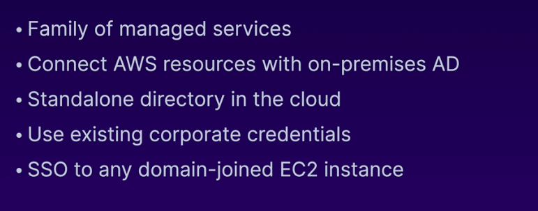

#### what is active directory


> ==LDAP== (Lightweight Directory Access Protocol) is a software protocol for enabling anyone to locate data about organizations, individuals and other resources such as files and devices in a network -- whether on the public internet or on a corporate intranet.


#### AWS managed Microsoft AD

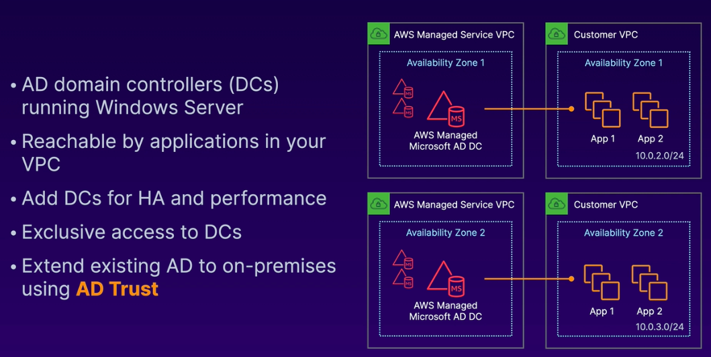

AWS vs. customer responsibility


> DCs:  Domain Controllers

#### Simple AD

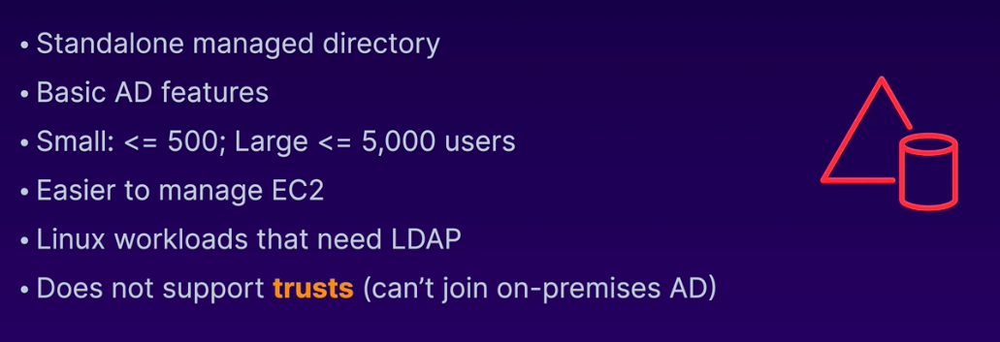

#### AD Connector


#### Cloud Directory


#### Amazon Congnito User Pools


#### AD v.s Non-AD compatible

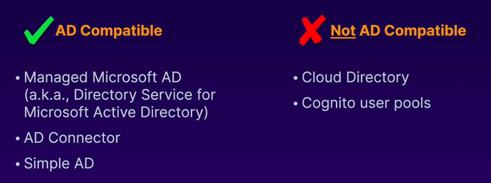


### IAM Policies

ARN

#### Amazon Rousource Name (ARN)


#### IAM Policies

- JSON doc that defines permissions.
- No effect until attached 
- List of statements
  - statement structure: Effect, Action, Resource

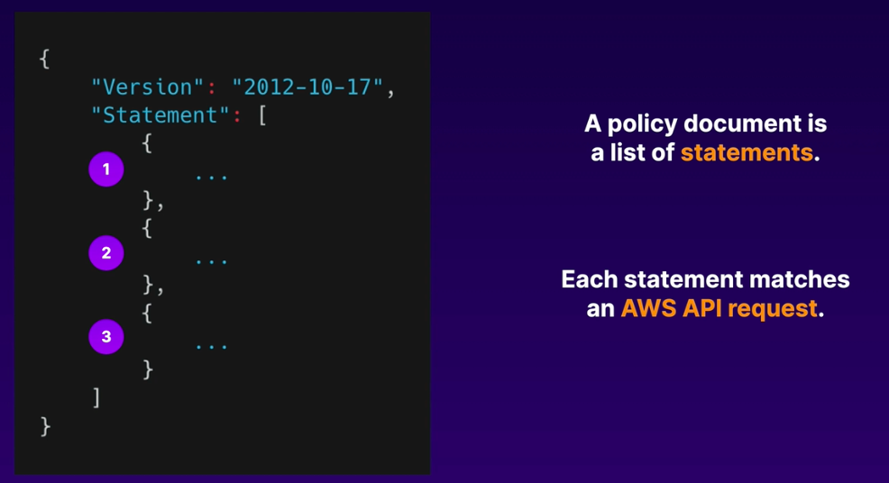


> Sid is for human to read, like a commend in code.

- Not explicitly allowed == implicitly denied 

- ==Explicit deny== ==overrides== everything else 

- Only attached policies have effect 

- AWS ==joins== all applicable policies

- AWS-managed vs. customer-managed 

- [Identity policy  vs. Resource policy]([https://docs.aws.amazon.com/IAM/latest/UserGuide/access_policies_identity-vs-resource.html#:~:text=A%20policy%20is%20an%20object,user%2C%20group%2C%20or%20role.](https://docs.aws.amazon.com/IAM/latest/UserGuide/access_policies_identity-vs-resource.html#:~:text=A policy is an object,user%2C group%2C or role.))

  > For same account? For cross-account request?
  >
  > 

#### Permission Boundaries

- Used to delegate administration to other users 
- Prevent privilege escalation or unnecessary broad permissions
- Control maximum permissions an IAM policy can grant 
- Use cases: 
  - Developers creating roles for Lambda functions 
  - Application owners creating roles for EC2 instances 
  - Admins creating ad hoc users 

### Resource Access Manager (RAM)

>  Account isolation / multi-account strategy 

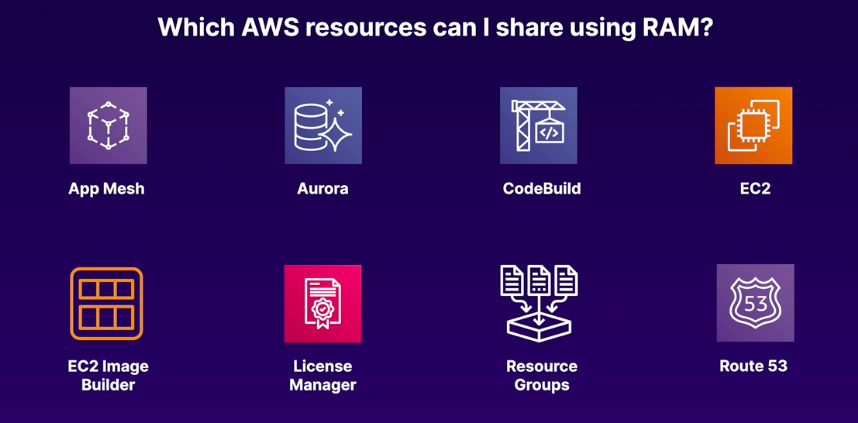

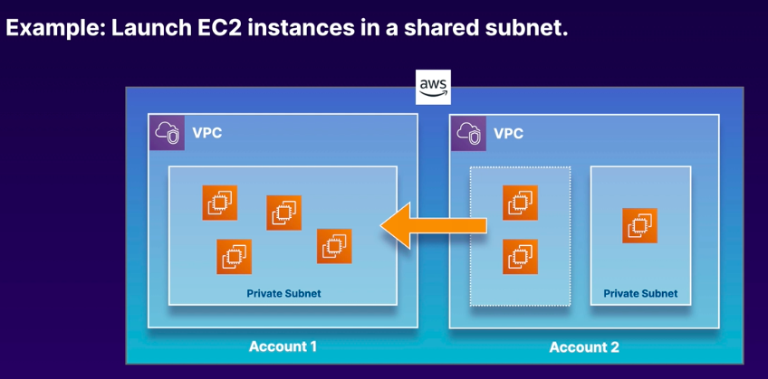

Action: How to share a resource to another account through ARM?

### AWS Single Sign-On

#### What is AWS SSO?

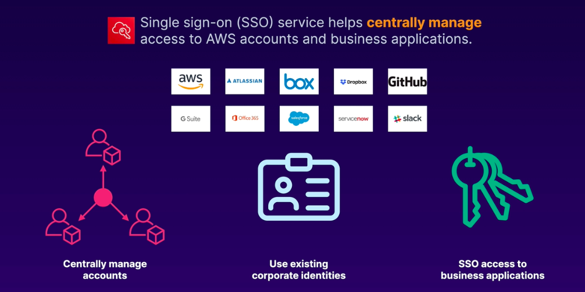

#### Granular Account-Level Permissions

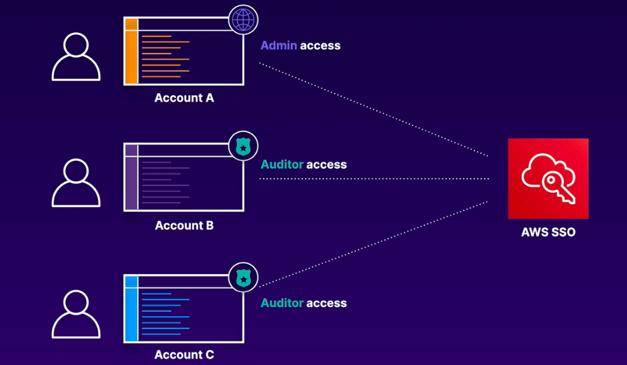

#### Active Directory and SAML Integration

> SAML: Security Assertion Markup Language


> IAM integrates with **existing active directory** account allowing single sign-on.


#### Others

- IAM Supports PCI DSS compliance

  > The Payment Card Industry Data Security Standard (==PCI DSS==) refers to payment security standards that ==ensure all sellers== safely and securely ==accept, store, process, and transmit== cardholder data (also known as your customers' credit card information) during a credit card transaction.

- IAM can be use for your users' management as well.


#### Things To search further

- **Power User Access** allows ==Access to all AWS services== except the management of groups and users within IAM.
- What is Resource Based Access Control List (ACL) 
- What is Setting up a cross account IAM Role for?

> An application you are working on has a new app. The development team for this app requires access to a bucket that is located within your team's aws account. The other team requires programmatic and console level access to your team's bucket. How would you share this bucket with this other team's account?
>
> [link](https://aws.amazon.com/premiumsupport/knowledge-center/cross-account-access-s3/)


### Q&A

- When updating the policy used by an IAM Role attached to an EC2 instance, what needs to happen for the changes to take effect?

  > Nothing - It will take effect immediately

## S3

### Pricing Tiers & Storage Classes

> what are they? what features they have? cost? what fits what?


#### Performance table

|                                    |      S3 Standard       | S3 Intelligent-Tiering* |     S3 Standard-IA     |    S3 One Zone-IA†     |       S3 Glacier        | S3 Glacier Deep Archive |
| :--------------------------------: | :--------------------: | :---------------------: | :--------------------: | :--------------------: | :---------------------: | :---------------------: |
|    Designed for ==durability==     | 99.999999999% (11 9’s) | 99.999999999% (11 9’s)  | 99.999999999% (11 9’s) | 99.999999999% (11 9’s) | 99.999999999% (11 9’s)  | 99.999999999% (11 9’s)  |
|     Designed for availability      |         99.99%         |          99.9%          |         99.9%          |         99.5%          |         99.99%          |         99.99%          |
|          Availability SLA          |         99.9%          |           99%           |          99%           |          99%           |          99.9%          |          99.9%          |
|         Availability Zones         |           ≥3           |           ≥3            |           ≥3           |           1            |           ≥3            |           ≥3            |
| Minimum capacity charge per object |          N/A           |           N/A           |       ==128KB==        |         128KB          |          40KB           |          40KB           |
|  Minimum storage duration charge   |          N/A           |         30 days         |        30 days         |        30 days         |         90 days         |        180 days         |
|           Retrieval fee            |          N/A           |           N/A           |    per GB retrieved    |    per GB retrieved    |    per GB retrieved     |    per GB retrieved     |
|         First byte latency         |    **milliseconds**    |    **milliseconds**     |    **milliseconds**    |    **milliseconds**    | select minutes or hours |      select hours       |
|            Storage type            |         Object         |         Object          |         Object         |         Object         |         Object          |         Object          |
|       Lifecycle transitions        |          Yes           |           Yes           |          Yes           |          Yes           |           Yes           |           Yes           |


### Security And Encryption

### Version Control

### Lifecycle Management and Glacier

### Lock Policies & Glacier Vault Lock


`modes`


Glacier Vault Lock


### Performance

#### prefix

- S3 has extremely low latency. You can get the first byte out of S3 within 100-200 milliseconds 

- To achieve a high number of requests: 3,500 PUT/COPY/POST/DELEtE and 5,500 GET/HEAD requests per second Per prefix

- what are Prefixes? (basically folder path)

  

  

#### multipart upload & byte-range fetches


#### S3 KMS limitation

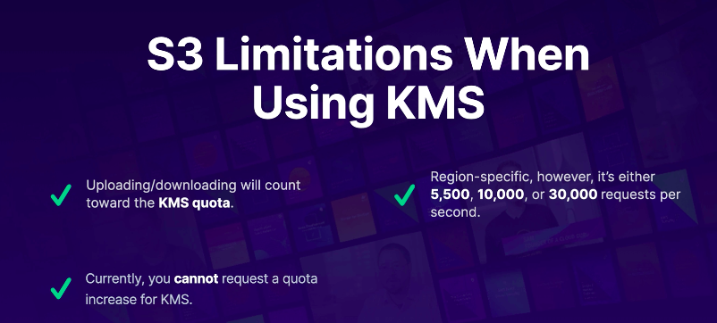


### Select & Glacier Select

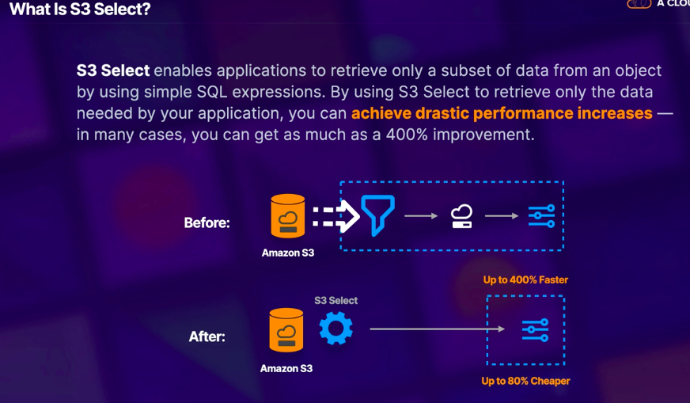


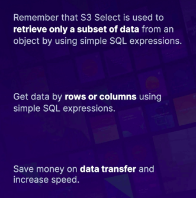

- Note that Se Select isused to retrived ==only a subset== of data ==from an object== . `csv` for example
- get data by __rows or columns__ using SQL
- save money on data transfer and increase speed


> [Selcet v.s Athena]([https://stackoverflow.com/questions/49102577/what-is-difference-between-s3-select-and-athena#:~:text=S3%20Select%20makes%20it%20easy,to%20retrieve%20the%20entire%20object.&text=Amazon%20Athena%20is%20an%20interactive%20query%20service%20that%20makes%20it,Amazon%20S3%20using%20standard%20SQL.](https://stackoverflow.com/questions/49102577/what-is-difference-between-s3-select-and-athena#:~:text=S3 Select makes it easy,to retrieve the entire object.&text=Amazon Athena is an interactive query service that makes it,Amazon S3 using standard SQL.))
>
> You can think about AWS S3 Select as a cost-efficient storage optimization that allows retrieving data that matches the predicate in S3 and glacier aka push down filtering.
>
> AWS Athena is fully managed analytical service that allows running arbitrary ANSI SQL compliant queries - group by, having, window and geo functions, SQL DDL and DML.

### AWS Organizations & Sharing S3 Buckets Between Accounts

### Cross Region Replication

### Transfer Acceleration


### DataSync

- Majorly used for moving on-premises data center to cloud.


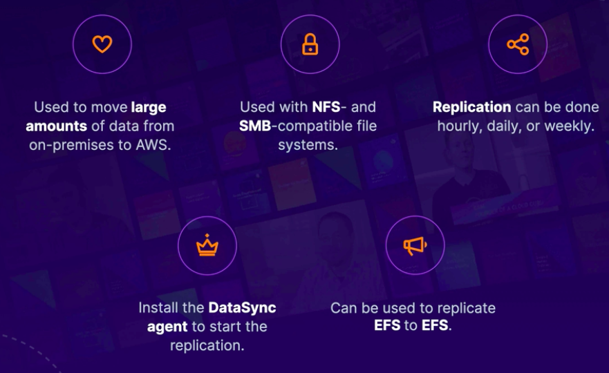

- Used to move large amount of data from on-premises to AWS. 
- Used with ==NFS-== and ==SMB==-compatible file systems.
- Replication can be done hourly, daily, or weekly.
- Install the ==DataSync agent== to start the replication. 
- Can be used to replicate ==EFS== to ==EFS==


### CloudFront Overview


### CloudFront Signed URLs and Cookies

> content access restriction

#### Use CloudFront Signed URLs or Signed Cookies

1. A signed URL is for individual files. 1 file => 1 URL
2. A signed cookie is for multiple files. 1 cookie => multiple files. ( 1 cookie for a user to use a peroid?)


#### Attach policy to Signed URL / Signed cookie


#### How Signed URLs work


#### CloudFront Signed URL


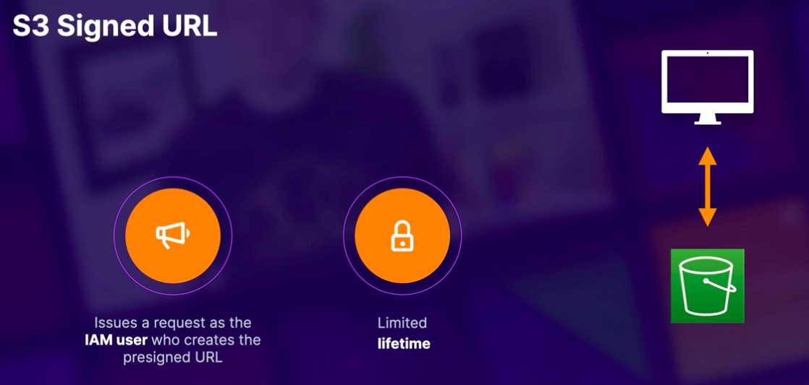


### Snowball Overview

### Storage Gateway

### Athena vs Macie


### Summary

Features

- Tiered Storage Available
- Lifecycle Management
- Versioning
- Encryption
- MFA Delete
- AC: **Access Control Lists** and **Bucket Policies**

-----

AC -- By default, all newly created buckets are PRIVATE. You setup access control to your bukets using:

- bucket policies
- access control lists

S3 beckets cna be configured to create access logs which log all requests made to the S3 bucket. This can be sent to another bucket and even another bucket in another account.

---

__Objects__: The Key fundaments of S3 Are:

- key (the name of the object)
- value (the object that is made up of a sequece of bytes )
- Version ID (important for versioning)
- Metadata (data about data you are storing)
- Subresources:
  - access control lists
  - torrent

-----

- Read after Write for PUTS of new Objects
- Eventual Consistency for overwrite PUTS and DELETES (can take some time to propagate)

---


#### data consistency model

- Amazon S3 provides **read-after-write** consistency for PUTS of new objects in your S3 bucket in all Regions with one caveat. `??` 
- Amazon S3 offers **eventual consistency** fo**r overwrite PUTS and DELETES** in all Regions.
- Updates to a single key are **atomic**. For example, if you PUT to an existing key, a **subsequent read** might return the old data or the updated data, but it **never** returns **corrupted or partial data**.
- 
- more "currently no"
  - object locking; race case need to be solved by application level
  - atomic updates across keys; need to design&implement our own on application level;

| Eventually consistent read | Consistent read                 |
| :------------------------- | :------------------------------ |
| Stale reads possible       | No stale reads                  |
| Lowest read latency        | Potential higher read latency   |
| Highest read throughput    | Potential lower read throughput |


- AWS S3 has four different URLs styles. What are they. what are they used for?


### Q&A

#### Access control
1. Which of the following options allows users to have secure access to private files located in S3? (Choose 3)

   - **CloudFront Signed URLs**
   - Public S3 buckets
   - **CloudFront Signed Cookies**
   - **CloudFront Origin Access Identity**

1. You run a popular photo-sharing website that depends on S3 to store content. Paid advertising is your primary source of revenue. However, you have discovered that other websites are linking directly to the images in your buckets, not to the HTML pages that serve the content. This means that people are not seeing the paid advertising, and you are paying AWS unnecessarily to serve content directly from S3. How might you resolve this issue?

   > Remove the ability for images to be served publicly to the site and then use signed URLs with expiry dates.

#### URL

1. AWS S3 has four different URLs styles that it can be used to access content in S3. The Virtual Hosted Style URL, the Path-Style Access URL, the Static web site URL, and the Legacy Global Endpoint URL. Which of these represents a correct formatting of the Virtual Hosted Style URL style

2. AWS S3 has four different URLs styles that it can be used to access content in S3. The `Virtual Hosted Style` URL, the `Path-Style Access` URL, the` Static web site` URL, and the `Legacy Global Endpoint` URL. Which of these represents a correct formatting of the `Virtual Hosted Style` URL style

   - `http://my-bucket.s3-website-ap-southeast-2.amazonaws.com/index.php`
   - `https://s3.us-west-2.amazonaws.com/my-bucket/slowpuppy.tar`
   - `https://www.my-registered-domain-guru/index.html`
   - `https://my-bucket.s3.us-west-2.amazonaws.com/fastpuppy.csv`
   - `https://my-bucket.amazonaws.com/lazycat.docx`
   - `http://my-bucket.s3-website.us-east-2.amazonaws.com/index.htm`

   > Virtual style puts your bucket name 1st, s3 2nd, and the region 3rd. 
   >
   > Path style puts s3 1st and your bucket as a sub domain. 
   >
   > Legacy Global endpoint has no region. 
   >
   > S3 static hosting can be your own domain or your bucket name 1st, s3-website 2nd, followed by the region. 
   >
   > AWS are in the process of phasing out Path style, and support for Legacy Global Endpoint format is limited and discouraged. However it is still useful to be able to recognize them should they show up in logs. Further information:

#### performance

> Performance scales per prefix, so you can use as many prefixes as you need in parallel to achieve the required throughput. There are no limits to the number of prefixes.
>
> What is prefixes

1. You have been asked to advise on a __scaling__ concern. The client has an elegant solution that works well. As the information base grows they use __CloudFormation__ to spin up another stack made up of an S3 bucket and supporting compute instances. The trigger for creating a new stack is when the PUT rate approaches 100 PUTs per second. The problem is that as the business grows that number of buckets is growing into the hundreds and will soon be in the thousands. You have been asked what can be done to reduce the number of buckets without changing the basic architecture.

   - Refine the key hashing to randomise the name Key to achieve the potential of 300 PUTs per second.
   - `I picked this` Upgrade all buckets to S3 provisioned IOPS to achieve better performance.
   - `correct` Change the trigger level to around 3000 as S3 can now accommodate much higher PUT and GET levels.
   - Set up multiple accounts so that the per account hard limit on S3 buckets is avoided.

   > Until 2018 there was a hard limit on S3 puts of `100` PUTs per second. To achieve this care needed to be taken with __the structure of the name Key to ensure parallel processing__. As of July 2018 the limit was raised to 3500 and the need for the Key design was basically eliminated. Disk IOPS is not the issue with the problem. The account limit is not the issue with the problem. Further information: 
   >
   > - https://aws.amazon.com/about-aws/whats-new/2018/07/amazon-s3-announces-increased-request-rate-performance/
   > - https://docs.aws.amazon.com/AmazonS3/latest/dev/request-rate-perf-considerations.html
   > - https://aws.amazon.com/s3/storage-classes/

#### storage class; what fits what

1. What is the availability of S3-OneZone-IA?

   __99.50%__ 99.90% 100% 99.99%

   > OneZone-IA is only stored in one Zone. While it has the same Durability, it may be less Available than normal S3 or S3-IA. Further information: https://aws.amazon.com/s3/storage-classes/?nc=sn&loc=3

2. A company currently store data on-premise. They are looking to migrate to AWS S3 and to store their data in buckets. Each bucket will be named after their individual customers, followed by a random series of letters and numbers. Once written to S3 the data is **rarely changed**, as it has already been sent to the end customer for them to use as they see fit. However, on some occasions, customers may need certain files **updated quickly**, and this may be for work that has been done months or even years ago. **You would need to be able to access this data immediately to make changes in that case, but you must also keep your storage costs extremely low**. The data is not easily reproducible if lost. Which S3 storage class should you choose to minimize costs and to maximize retrieval times?

   

3. You work for a major news network in Europe. They have just released a new mobile app that allows users to post their photos of newsworthy events in real-time, which are then reviewed by your editors before being copied to your website and made public. Your organization expects this app to grow very quickly, essentially doubling its user base each month. The app uses S3 to store the images, and you are expecting sudden and sizable increases in traffic to S3 when a major news event takes place (as users will be uploading large amounts of content.) You need to keep your storage costs to a minimum, and it does not matter if some objects are lost. With these factors in mind, which storage media should you use to keep costs as low as possible?

   > > Answer is: __S3 - One Zone-IA__
   >
   


##### cost of retrieval from Glacier

You have been asked to set up a **recovery process** that generates the **lowest possible cost** for **retrieving information from Glacier**. There is petabytes of information that need to be retrieved if this process is to be enacted. Which of the following retrieval options would allow you to achieve this?

> It dependents on the speed and size of the data is request

- Expedited retrievals allow you to **quickly** access your data stored in the S3 Glacier storage class when occasional urgent requests for a **subset** of archives are required, but at the **highest** cost. 

- Standard retrievals allow you to access any of your archived objects **within several hours**, this is faster than bulk (averaging around 12 hours) but more expensive. 
- Bulk retrievals are the lowest-cost retrieval option in Amazon S3 Glacier, enabling you to **retrieve large amounts**, even petabytes, of data inexpensively. 
- Further information: https://docs.aws.amazon.com/AmazonS3/latest/user-guide/restore-archived-objects.html


#### others

1. How many S3 buckets can I have per account by default?  => 100

## EC2

### Config

#### Using Boot Strap Scripts With EC2

> example

```bash
#!/bin/bash
yum update -y
yum install httpd -y
service httpd start
chkconfig httpd on
echo "<html><h1>Hello World!</h1></html>" > /var/www/html/index.html
aws s3 mb s3://ajsdklfajsdlfjasl_asf2332
aws s3 cp /var/www/html/index.html s3://ajsdklfajsdlfjasl_asf2332
```

> Looks like this EC2 has the access right to S3 by default?

#### EC2 Instance Meta Data

- `curl http://169.254.169.254/latest/user-data` will get the boot strap script

- `curl http://169.254.169.254/latest/meta-data` will get a list of path.

- `curl http://169.254.169.254/latest/meta-data/public-ipv4`,  will get the public ip.


#### EC2 Placement Groups

- You cannot merge PG.
- You can move an instance into a PG via AWS CLI / SDK, only when the instance in the stopped state. (Not console yet.)

##### cluster placement group

- A group of instances within a ==single AZ==. Recommend homogenous instances within CPG.
- Only certain instances can be launched into a cluster placement group
- It's ideal when your fleet of EC2 instances requires high network throughput and low latency within a single availability zone.

##### Spread Placement Groups

- Spread instances to different hardware.
- Can be in same AZ or cross AZ. (But have to be ==same region==)
- Can Spread Placement Groups be deployed across multiple Availability Zones? __Yes.__

##### Partition Group


#### EC2 Hibernate


- to use Hibernation, the root volume must be encrypted


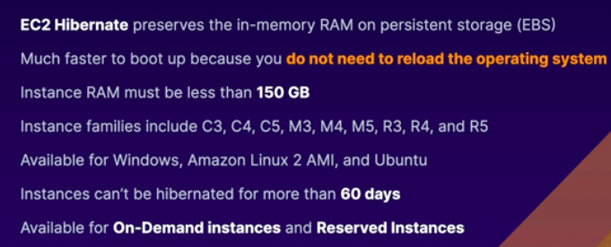

> t2.micro inluded as well.


#### Spot Instances & Spot Fleet

Spot instance price history

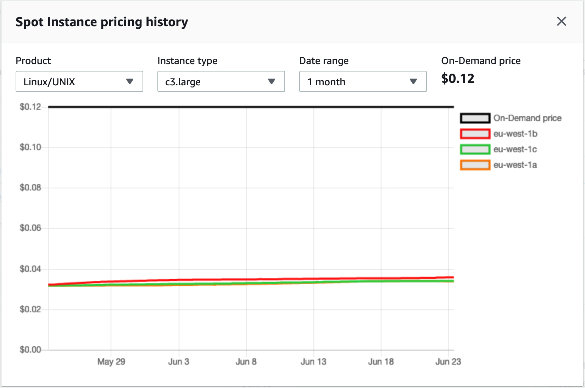

- Good for
  - CI/CD; Testing
  - webservices
  - Big data and analytics
  - image and media rendering
  - containerized workload
  - high performance computing

- not good for 
  - Critical jobs
  - Persistent workload
  - DB
- You can block Spot Instances from terminating by using ==Spot Block==

##### Spot requests


##### Spot Fleet

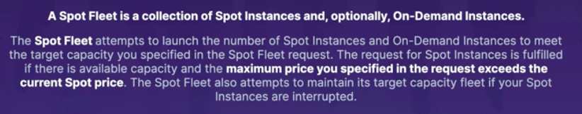


you can have the following strategies with Spot Fleet


#### Hypervisor

- Hypervisor for EC2: `Nitro` and `Xen`


### [EC2 Auto Scaling](https://aws.amazon.com/ec2/autoscaling/?nc2=h_ql_prod_cp_ec2auto)

Amazon EC2 Auto Scaling helps you ==maintain application availability== and allows you to ==automatically add or remove EC2 instances according to conditions you define==. You can use the ==fleet management== features of EC2 Auto Scaling to maintain the health and availability of your fleet. You can also use the ==dynamic and predictive scaling== features of EC2 Auto Scaling to add or remove EC2 instances. ==Dynamic scaling== responds to changing demand and predictive scaling automatically schedules the right number of EC2 instances based on predicted demand. Dynamic scaling and predictive scaling can be used together to scale faster.


### EBS

Elastic Block Store (EBS) is an easy to use, high performance ==block storage service== designed for use with Amazon Elastic Compute Cloud (EC2) for both throughput and transaction intensive workloads at any scale.

-  ==Termination Protection== is ==turned off== by default

  - Root volume will be deleted by default
  - Additional  colume would not

  > ( By default) If you turn off a EC2, what would happend to the root volume / addtional volume? 
  >
  > Root one would be terminated as well; but additional ones will persistent.

- Can I delete a snapshot of an EBS Volume that is used as the root device of a registered AMI?

  > If the original snapshot was deleted, then the AMI would not be able to use it as the basis to create new instances. For this reason, AWS protects you from accidentally deleting the EBS Snapshot, since it could be critical to your systems. To delete an EBS Snapshot attached to a registered AMI, first remove the AMI, then the snapshot can be deleted

- Which AWS CLI command should I use to create a snapshot of an EBS volume?

  > `aws ec2 create-snapshot`

  


- Which of the following provide the lowest cost EBS options? =>  Cold (sc1) and Throughout Optimized (st1) types are HDD based and will be the lowest cost options.


#### volume types

The following table shows use cases and performance characteristics of current generation EBS volumes:

|                                |                             SSD                              |                             SSD                              | HDD                                                          | HDD                                                          |
| :----------------------------: | :----------------------------------------------------------: | :----------------------------------------------------------: | ------------------------------------------------------------ | ------------------------------------------------------------ |
|          Volume Type           |                EBS Provisioned IOPS SSD (io1)                |                EBS General Purpose SSD (gp2)*                | Throughput Optimized HDD (st1)                               | Cold HDD (sc1)                                               |
|       Short Description        | Highest performance SSD volume designed for latency-sensitive transactional workloads | General Purpose SSD volume that balances price performance for a wide variety of transactional workloads | Low cost HDD volume designed for frequently accessed, throughput intensive workloads | Lowest cost HDD volume designed for less frequently accessed workloads |
|             Price              |       ==\$0.125==/GB-month​ ==$0.065==/provisioned IOPS       |                      ==$0.10==/GB-month                      | $0.045/GB-month                                              | $0.025/GB-month                                              |
|          Volume Size           |                         4 GB - 16 TB                         |                         1 GB - 16 TB                         | ==500 GB== - 16 TB                                           | 500 GB - 16 TB                                               |
|           Use Cases            |         I/O-intensive NoSQL and relational databases         |    Boot volumes, low-latency interactive apps, dev & test    | Big data, data warehouses, log processing                    | Colder data requiring fewer scans per day                    |
|       Max IOPS**/Volume        |                          ==64,000==                          |                            16,000                            | 500                                                          | 250                                                          |
|    Max Throughput***/Volume    |                          1,000 MB/s                          |                           250 MB/s                           | 500 MB/s                                                     | 250 MB/s                                                     |
|       Max IOPS/Instance        |                            80,000                            |                             Same                             | Same                                                         | Same                                                         |
|    Max Throughput/Instance     |                          2,375 MB/s                          |                             Same                             | Same                                                         | Same                                                         |
|            API Name            |                             io1                              |                             gp2                              | st1                                                          | sc1                                                          |
| Dominant Performance Attribute |                             IOPS                             |                             IOPS                             | MB/s                                                         | MB/s                                                         |


#### Volumes & Snapshots

1. region always be the same as the connected EC2. ( Of cause you want your hard disk be close to the compute)

2. You can change your volume (increase or decrease) on the fly ==even for the root device==! 

   > It's crazy. How?

3. Typical scenario: Your client want to move the root device EBS to another AZ. How?

   1. My guess: Make a Snapshot => make AMI from the Snapshot => copy the AMI to target region/AZ => Make a device from the Snapshot

4. Snapshots are incremental 

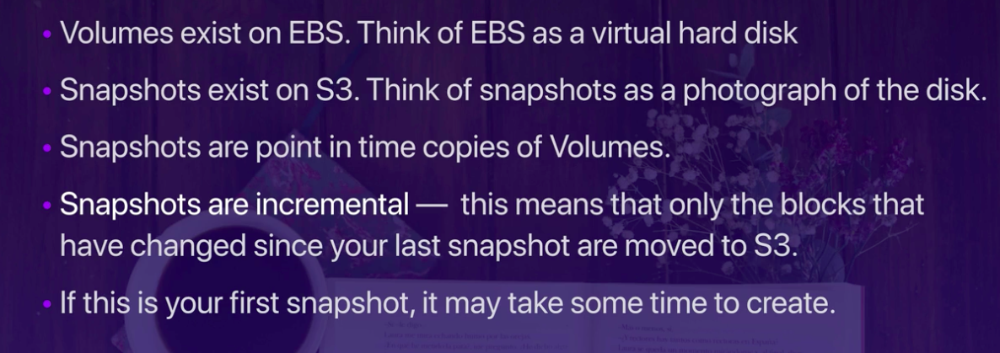


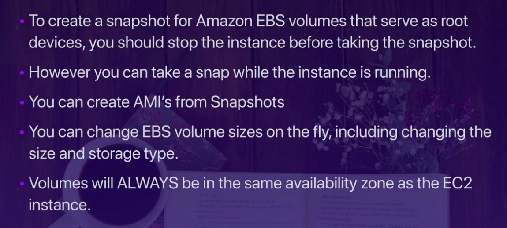


#### Encrypted Root Device Volumes & Snapshots


#### How to encrypt an unencrypted instance

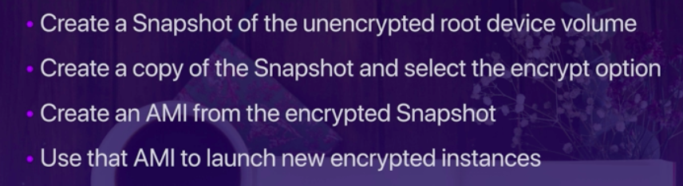


#### AMI Types (EBS vs Instance Store)

You can select your AMI based on:

- Region 

- OS 

- Launch Permissions

- Storage for the Root Device (Root Device Volume)

  - Instance Store ( Emphemeral Storage )

    > The root device for an instance launched from the AMI is an instance store volume created form a template stored in Amazon S3

  - EBS Backed Voumes

    > The root device for an instance launched from the AMI is an Amazon EBS volume created from an Amazon EBS snapshot


### EFS - Elastic File System

> Like EBS, but you can connect it to multi-EC2

- consistency model: read after write 
- can support thousands of concurrent NFS connections
- only pay for the storage you use
- Data is stored across multiple AZ
- there is life-cycle that can move data to EFS-IA to save money.

#### [AWS EFS vs. AWS EBS: Which one should you use?]([https://n2ws.com/blog/aws-ebs-snapshot/aws-fast-storage-efs-vs-ebs#:~:text=While%20EFS%20does%20cost%20more,you%20pay%20for%20each%20volume.](https://n2ws.com/blog/aws-ebs-snapshot/aws-fast-storage-efs-vs-ebs#:~:text=While EFS does cost more,you pay for each volume.))

While both EBS and EFS offer great features, these two storage solutions are actually built for two completely different uses. EBS volumes are limited to a single instance, and, more importantly, then can only be accessed by one instance at a time. With EFS, you can have hundreds or thousands of instances accessing the file system simultaneously. This makes AWS EFS a great fit for any use that requires a decent performing centralized shared storage—uses like media processing or shared code repositories.

You can also use AWS EFS to serve web content, keep various backups, and reduce storage spending. While EFS does cost more than EBS ($0.30 per GB for EFS vs. $0.10 per GB for EBS), you only pay once per EFS file system. This means that if you attach a dozen instances to it, you will still pay the same amount as if you only had one instance attached to it. With EBS volumes, you pay for each volume. Therefore, to save money on storage, EFS can sometimes serve as a replacement for EBS.

EFS scales performance along with capacity, and, while this can be very beneficial in some cases, it can also be a significant drawback. You might not have high enough utilization to reach the desired throughput of the file system. Because AWS EBS provides you with steady and predictable performance, EBS is almost always be a better fit, unless you require that multiple instances access your storage at the same time,


### FSx for Windows & FSx for Lustre

> Amazon FSx for Windows File Server provides fully managed, highly reliable, and scalable file storage that is accessible over the industry-standard Server Message Block (SMB) protocol. It is built on Windows Server, delivering a wide range of administrative features such as user quotas, end-user file restore, and Microsoft Active Directory (AD) integration. It offers single-AZ and multi-AZ deployment options, fully managed backups, and encryption of data at rest and in transit. You can optimize cost and performance for your workload needs with SSD and HDD storage options; and you can scale storage and change the throughput performance of your file system at any time. Amazon FSx file storage is accessible from Windows, Linux, and MacOS compute instances and devices running on AWS or on premises. 

#### Windows FSx vs. EFS

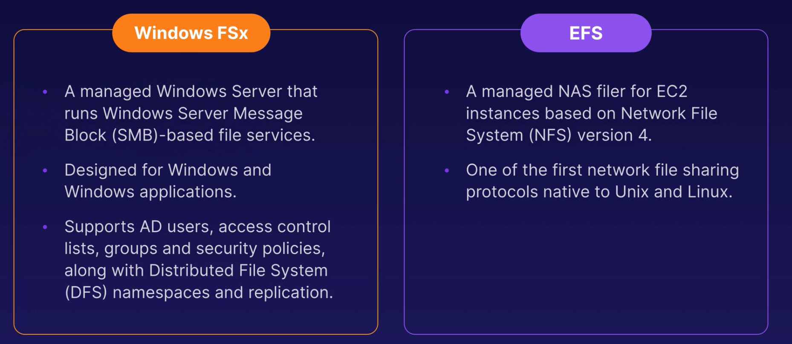

#### Lustre FSx vs. EFS


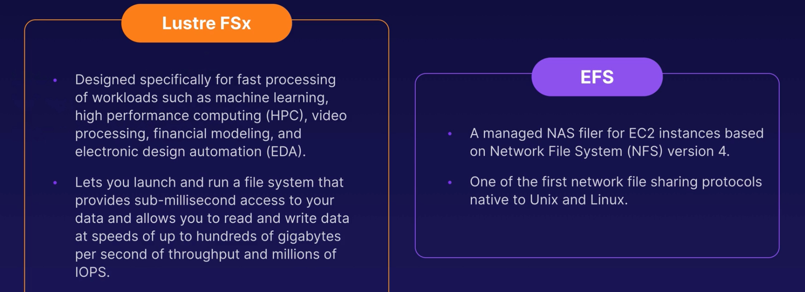

#### How to chose: EFS vs. Windows FSx vs. Lustre FSx


### Security Groups

- regional

- allowing one inbound rule auto allows one outbound rule ( `Stateful` )

- DB type SG auto sets the port

- Cannot block specific IP addresses. Can specify allow rules, but not deny rules. (Deny by default)

  > instead use Network Access Control Lists (ACL)

- By default, all inbound traffic is `blocked` and all outbound traffic is allowed.

- Change take effect immediately.


### ENI vs ENA vs EFA

#### Elastic Network Interface - Essentially a virtual network card


#### Enhanced Networking

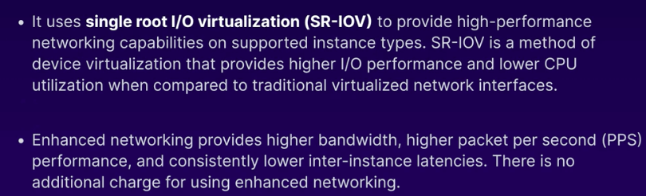

- No additional charge! 
- use where you want good network performance ( inter-instance )

- Depending on your instance type, Enhanced Networking can be enabled using:


#### Elastic Fabric Adapter

> for Machine learning, HPC (high performance computing)


#### How to chose

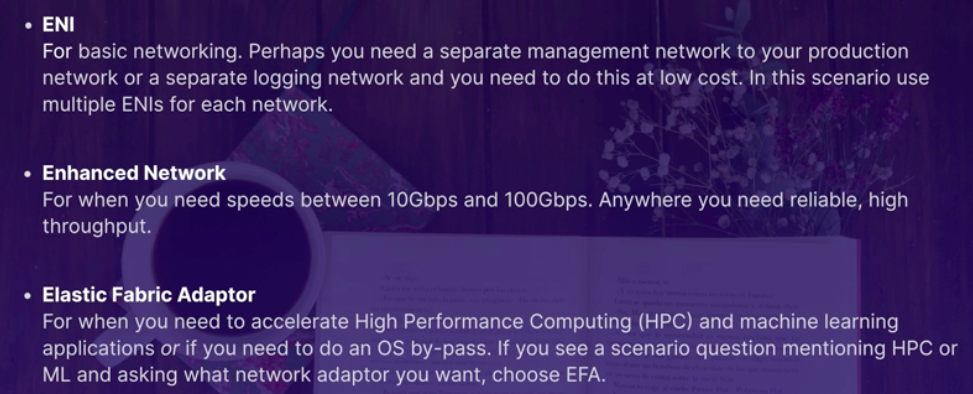


### CloudWatch

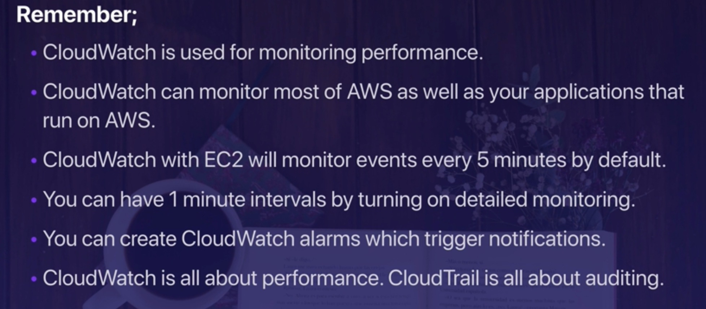

- on EC2 normally 5 mins; turning on ==detailed monitoring== 1 min intervals ( non-free tier )
- CloudWatch alarm example: "CPU > 90% in 3 mins out of 10mins".
- CloudTrail knows who did what. CloudWatch knows how heavy are their burden.


### HPC - High Performance Computing

#### Data transfer

- Snowball, Snowmobile 

- AWS ==DataSync== to store on S3, EFS, FSx for Windows, etc

- ==Direct Connect==

  

- 


#### Compute and Network


#### Storage


#### Orchestration and automation

##### AWS Batch

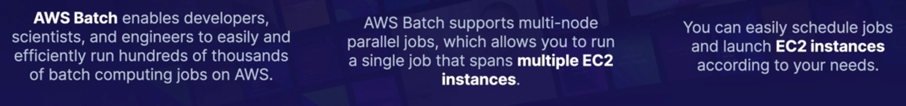

##### AWS ParallelCluster

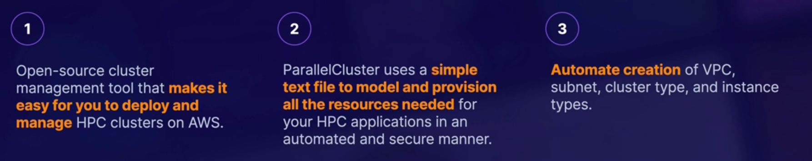


### WAF - Web Application Firewall

- Let you monitor the HTTP and HTTPS requests that are forwarded to ==Amazon CloudFront==, and Application Load Balancer or ==API Gateway==.

- Also lets you control access to your content.
- You can configure conditions such as what IP are allowed to make the request or what query string parameters need to be passed.

At its most basic level, allows 3 different behaviours:

- ==Allow== all requests except the ones you specify
- ==Block== all requests except the ones you specify
- Count the requests that match the properties you specify


##### Application examples

- your country embargos a country, how do you achieve that? WAF is one solution. you can block request from a specific country.

- How to block malicious IP addresses?
  - Use WAF
  - Use Network ACLs
  - 


### Q&A

- Will an Amazon EBS root volume persist independently from the life of the terminated EC2 instance to which it was previously attached? In other words, if I terminated an EC2 instance, would that EBS root volume persist? 

  > Yes - Unless 'Delete on Termination' is not unchecked for the volume

- You need to know both the private IP address and public IP address of your EC2 instance. You should ________.

  > Retrieve the instance Metadata from http://169.254.169.254/latest/meta-data/.
  
- What feature allows to utilize `SR-IOV`? =>  **Enhanced Networking**

  > SR-IOV, or Single Root I/O Virtualization, is a feature of **Enhanced Networking** used to provide higher networking performance. On a normal EC2 instance, multiple EC2 instances may share a single physical network interface on the EC2 Host. SR-IOV effectively dedicates the interface to a single instance, and bypasses parts of the Hypervisor, allowing for better performance Further information:

- Standard Reserved Instances can be moved between regions? __False__


## DB


### Databases 101
### Let's Create An RDS Instance

### RDS Backups, Multi-AZ & Read Replicas

### RDS Backups, Multi-AZ & Read Replicas - Lab

### DynamoDB

### Advanced DynamoDB

### Redshift

### Aurora

### Elasticache

### Database Migration Service (DMS)

### Caching Strategies on AWS

### EMR Overview

### Migration

- Which AWS service would simplify the migration of a database to AWS?

A) AWS Storage Gateway 

B) AWS Database Migration Service (AWS DMS) 

D) Amazon AppStream 2.0


### Quiz


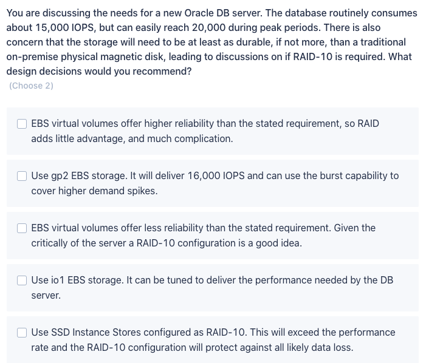


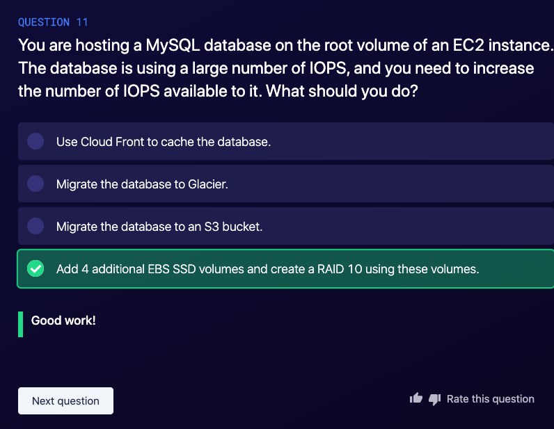


## Route 53

unable to health check: simple routing; 

### DNS 101

- ELBs don't have pre-defined IPv4 addresses; you resolve to them using a DNS name.

- Diff: Alias Record vs CNAME

- Common DNS Types:

  -  NS Records; A Records;  CNAME;

  - SOA Records: Start of Authority record containing administrative information about the zone, especially regarding zone transfers.

  - MX Records: mail exchanger record. 

    > ```
    > Domain			    TTL   Class    Type  Priority      Host
    > example.com.		1936	IN	     MX	   10         onemail.example.com
    > example.com.		1936	IN	     MX	   10         twomail.example.com
    > ```

  - PTR Records: opsite of A record. resolves an IP address to a domain or host name.

- Register domain name might take up 3 days.


### [choosing routing policies](https://docs.aws.amazon.com/Route53/latest/DeveloperGuide/routing-policy.html)

- Available policies types?


- simple routing policy
  - One record with multiple IP addresses. 
  - If specify multiple values in a record, Route 53 returs all value to users in random order.

  > No health check. When you don't care much about availability or you only have one machine.

- Multivalue answer: simple routing +

  - with health check on each record.

- weighted Routing policy
  - You set multiple records with weight values and Route 53 splits traffic based on weight. 
  - support health check and auto ignore unhealthy nodes
  - can set SNS norification for failure on health check

- Latency routing


- Failover routing
  - primary and secondary instances: Auto failover

- Geolocation routing
  - geography boundary based routing.
  - scenario: region price/legal/language diffrence. 

- Geoproximity routing (traffic flow only)
  - Highly customizable. Highly complicated.


### others

Alias record: 

#### 

  


## VPCs 

> SA-A are expected to be able to build a VPC by memory

#### VPC general topic

Application scenario:

> You can easily customize the network configuration for your Amazon Virtual Private Cloud. 

- You can create a ==public-facing subnet== for your webservers that has access to the Internet, and place your backend systems such as databases or application servers in a ==private-facing subnet== with no Internet access. You can leverage multiple layers of security, including security groups and network access control lists, to help control access to Amazon EC2 instances in each subnet. 
- You can create a Hardware Virtual Private Network (VPN) cnnection between your corporate datacenter and your VPC and leverage the AWS cloud as an extension of your corporate datacenter.
- Security Group does not span accross VPCs


> Network ACL serves as first sec layer. 


#### subnet

- IP for subnet
  - 10 0 0.0 - 10.255 255 255 (10/8 prefix)
  - 172.16.0.0 - 172 31.255 255 (172.16/12 prefix)
  - 192.168.0.0 - 192.168.255.255 (192.168/16 prefix) 

- `/28` is the smallest subnet (16) you are allowed to use in AWS VPC.
- A subnet must be in ==1 AZ==

- 5 IP addresses are reserved:


#### What can we do with a VPC?

- Launch instances into a subnet of your choosing 
- Assign custom IP address ranges in each subnet 
- Configure route tables between subnets 
- Create intenet gateway and attach it to our VPC 
- Much better security control over your AWS resources 
- Instance security groups 
- Subnet network access control lists (ACLS) 

#### Default VPC vs Custom VPC

- Default VPC is user friendly, allowing you to immediately deploy instances.
- All Subsets in default VPC ==have a route out== to the internet. 
- Each EC2 instance has both a public and private IP address. 

#### VPC Peering

- connect one VPC with another via a direct network route using private IP addresses. 

- Instances behave as if they were on the same private network

- You can peer VPC's with other ==AWS accounts== as well as with other VPCs in the same account.

  >  ?? Peering is in a star configuration: ie 1 central VPC peers with 4 others. 

- ??  When you create a VPC a default Route Table, Network Access Control List (NACL) and a default Security Group. It won't create any ==subnets==, nor will it create a default ==internet gateway==. 
- US-East-1A in your AWS account can be a completely different availability zone to US-East-1A in another AWS account. The ==AZ's are randomized==. 
- Amazon always reserve 5 IP addresses within your subnets. (first 4 and the last)
- You can only have ==1 Internet Gateway per VPC==. 
- Allows you to connect one VPC with another via a direct network route using private IP addresses. 
- Instances behave as if they were on the same private network • You can peer VPC's with other AWS accounts as well as with other VPCs in the same account. 
- Peering is in a star configuration: ie 1 central VPC peers with 4 others. NO ==TRANSITIVE PEERING==!!! 
- You can peer ==across regions==. 


### Practice - Build A Custom VPC

1. Creating a custom VPC

- When you create a VPC, a default Route Table, Network Access Control List (NACL) and a default Security Group is created.
- It won't create any subnets, nor will it create a default internet gateway.


2.  create subnet


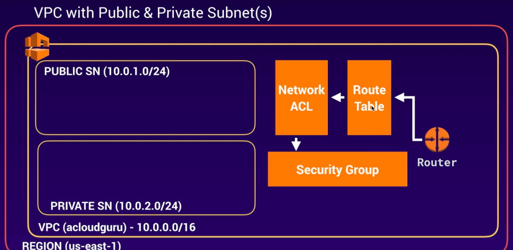

By default, any subnet will be associated to ==Main Route Table== if not explicitly associated with a route table.

Default Route Table is public accessable?

3. create a IGW and attach it to VPC

   > Note that 
   >
   > 1. only one IGW per VPC.
   > 2. IGW are design (by AWS) to be aways available.

4. Create a Route table name "MyPublicRouteTable"  

   -  Route table is inside a VPC
   - Adding public access :

   

   ==> 

   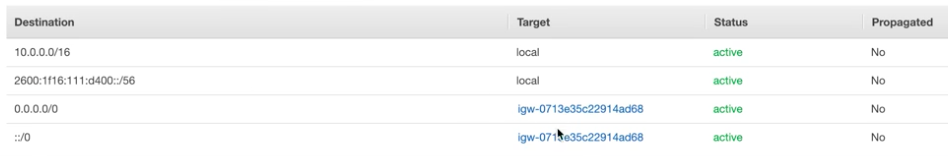


5. We create two EC2 instances: `MyWebServer` in public subnet and `MyDBServer` in private subnet.

> We have the IP address for the first one, but we cannot access the one in private subnet.


Create a security group called `MyDBSG`

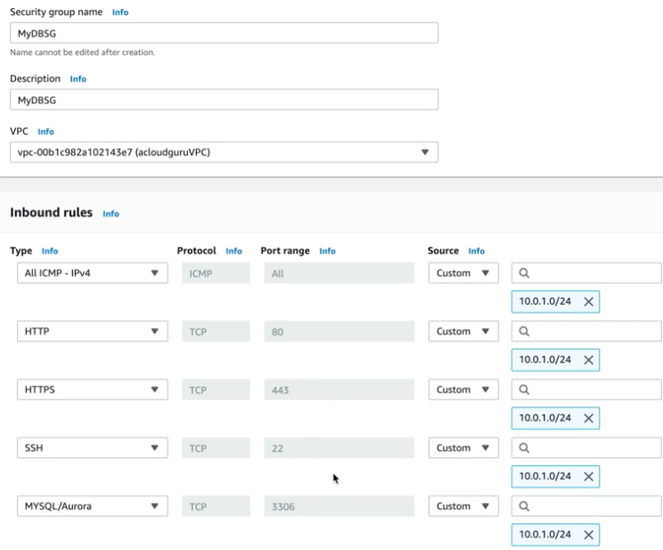

After accosiate this SG to the `MyDBServer`, now we can SSH from `MyWebServer` to `MyDBServer`. 

> Though in this lab we simply pass the private key as auth. It's best to use bastion host to avoid storing key in server. Will be discussed later.


Now we can SSH to `MyDBServer`. But if we try `yum update` we will have a timeout. That's because it's in private subnet.

Next section is `NAT Instance` and `NAT gateway` which will help to solve this. 


### Network Address Translation (NAT)

> In order to download software, the private subnet need to communicate with IGW.
>
> `NAT Gateway` and `NAT Instances` are to solve this issue. 
>
> `NAT Gateway` are ==HA==, while  `NAT Instances` ( slight outdated ) are ==EC2 instances and might fail==. 


### Access Control Lists (ACL)

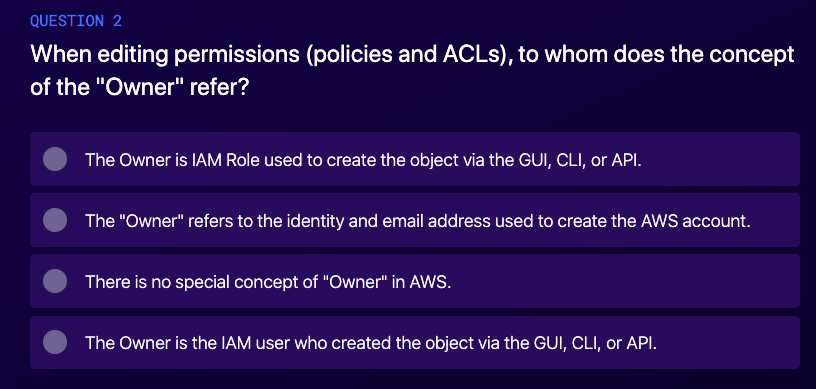


### Custom VPCs and ELBs

### VPC Flow Logs

### Bastions

### Direct Connect

### Setting Up A VPN Over A Direct Connect Connection

### Global Accelerator

### VPC End Points


### NAT ( network address translation )

#### NAT Instances

- When creating a NAT instance, Disable Source/Destination Check on the Instance. 

- ==NAT instances== must be in a ==public== subnet. 
- There must be a ==route out of the private subnet to the NAT instance==, in order for this to work. 
- The amount of ==traffic== that NAT instances can support depends on the ==instance size==. If you are bottlenecking, increase the instance size. 
- You can create ==high availability using Autoscaling Groups==, multiple subnets in different AZs, and a script to automate failover. 
- behind a SG

#### NAT Gateways


### ACL ( Access Control Lists )

- VPC automatically comes with a default network ACL 

  > by default it ==allows all== outbound and inbound traffic. 

- You can create custom network ACLs. 

  > by default, custom network ACL ==denies all== inbound and outbound traffic. 

- Each subnet in your VPC ==must be associated with a network ACL==. If you don't explicitly associate a subnet with a network ACL, the subnet is automatically associated with ==the default== network ACL. 

- Block IP Addresses using network ACLs not Security Groups. 


- `1-N ACL-subnet ` You can associate a network ACL with ==multiple subnets==; however, a subnet can be associated with only one network ACL at a time. 

  > When you associate a network ACL with a subnet, the previous association is removed.

- Network ACLs contain a numbered list of rules that is evaluated in order, ==starting with the lowest numbered rule.== 

  > ?? does the later override the previous?

- Network ACLs have separate inbound and outbound rules, and each rule can either allow or deny traffic. 

- Network ACLs are ==stateless==; responses to allowed inbound traffic are subject to the rules for outbound traffic (and vice versa.) 

- 


### build a custom VPC and ELBs


### VPC Flow Logs


### Bastions

### Direct Connect

### Setting up a VPN over a direct connect connection

### Global accelerator

### VPC End points

- There are two types of VPC endpoints: Interface Endpoints, Gateway Endpoints 
  - Currently Gateway Endpoints Support: Amazon S3, DynamoDB 


## HA Architecture

#### Load Balancers And Health Checks 

- Sticky Sessions enable your users to stick to the same EC2 instance. Can be useful if you are storing information locally to that instance. 

  > only ALB and classical LB support this feature because [it is implemented by cookie](https://stackoverflow.com/questions/46912629/aws-network-load-balancing-session-stickiness-not-consistent)

- Cross Zone Load Balancing enables you to load balance across multiple AZs. 

- ==Path patterns== allow you to direct traffic to different EC2 instances based on the ==URL== contained in the request. 


#### Autoscaling Theory

#### Autoscaling Groups Lab

#### HA Architecture

#### HA WordPress Site

#### Setting Up EC2

#### Adding Resilience And Autoscaling

#### Cleaning Up

#### CloudFormation

#### Elastic Beanstalk


## Application

### SQS

- SQS is a way to de-couple your infrastructure SQS is pull based, not pushed based. 

- Messages are 256 KB in size. 

- ==Visibility Time Out== is the amount of time that the message is invisible in the SQS queue after a reader picks up that message. ==Maximun is 12 hours==

  > Provided the job is processed before the visibility time out expires, the message will then be deleted from the queue. 
  >
  > If the job is not processed within that time, the message will become visible again and another reader will process it. This could result in the same message being delivered twice. 

- ==retention period==:  can be ==1 minute to 14 days==; by ==default is 4 days==. 

- Standard SQS vs FIFO SQS

  - Standard: order is not guaranteed and messages can be delivered more than once. 
  - FIFO: order is strictly maintained and messases are delivered only once. 

> With standard SQS / FIFO SQS, how to ensure a message is processed once and only once?

#### FAQ

Q: Do Amazon SQS batch operations cost more than other requests?

No. Batch operations ([SendMessageBatch](https://docs.aws.amazon.com/AWSSimpleQueueService/latest/APIReference/API_SendMessageBatch.html), [DeleteMessageBatch](https://docs.aws.amazon.com/AWSSimpleQueueService/latest/APIReference/API_DeleteMessageBatch.html), and [ChangeMessageVisibilityBatch](https://docs.aws.amazon.com/AWSSimpleQueueService/latest/APIReference/API_ChangeMessageVisibilityBatch.html)) all cost the same as other Amazon SQS requests. ==By grouping messages into batches, you can reduce your Amazon SQS costs.==

Q: What can I do with the Amazon SQS Free Tier?

The Amazon SQS Free Tier provides you with ==1 million requests== per month at no charge.

### SWF

> Kind of a human version of SQS

#### SWF vs SQS 

- Amazon SWF presents a ==task-oriented== API,  

  > SQS offers a message-oriented API. 

- SWF, workflow execution, can last up to ==1 year== 

  > SQS has a retention period of ==up to 14 days==;

- Amazon SWF ensures that ==a task is assigned only once== ( never duplicated )

  > With Amazon SQS, you need to ==handle duplicated== messages and may also need to ensure that a message is processed only once. 

- Amazon SWF keeps track of all the tasks and events in an application. 

  > With Amazon SQS, you need to implement your own ==application-level tracking==, ==especially== if your application uses ==multiple queues==. 

#### Actors

- Workflow Starters — An application that can initiate (start) a workflow. Could be your e-commerce website following the placement of an order, or a mobile app searching for bus times. 
- Deciders — Control the flow of activity tasks in a workflow execution. If something has finished (or failed) in a workflow, a Decider decides what to do next. 
- Activity Workers — Carry out the activity tasks. 


### SNS

Benefits 

- Instantaneous, ==push==-based delivery (no polling) 
- Simple APIs and easy integration with applications
- Flexible message delivery over multiple transport protocols 
- Inexpensive, pay-as-you-go model with no up-front costs 
- Web-based AWS Management Console offers the simplicity of a point-and-click interface 


### Elastic Transcoder

A media transcoder in the cloud. It converts media files from their original source format in to different formats that will play on smartphones, tablets, PCs, etc. 

### API Gateway

#### What can it do?

- Expose ==HTTPS endpoints== to define a RESTful API 
- ==Serverless-ly== connect to services like Lambda & DynamoDB 
- Send each API endpoint to a ==different target== 
- Run efficiently with ==low cost== 
- Scale effortlessly (==auto==)
- Track and control usage by API key 
- ==Throttle== requests to prevent attacks
- Connect to ==CloudWatch to log== all requests for monitoring 
- Maintain multiple ==versions== of your API 
- support ==cashing== to increase performance

> - ==Enable CORS== to support JS/AJAX that use multiple domains

#### Deployment

- to a stage
  - use API Gateway domain, by default
  - can use custom domain
  - now supports AWS Certificate Manager: free SSL/TLS certs
  - 

#### Related topic

- CORS Cross-origin-resource-sharing
  - Is a mechanism that allows restriced resources (e.g fonts) on a web page to be requested from another domain outside the domain from which the first resource was served.
  - The server can relax the same-origin policy. 
- Same-origin policy 


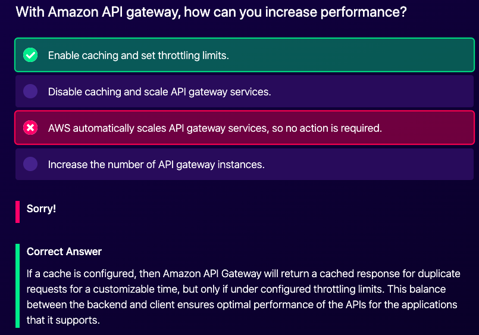

### Kinesis

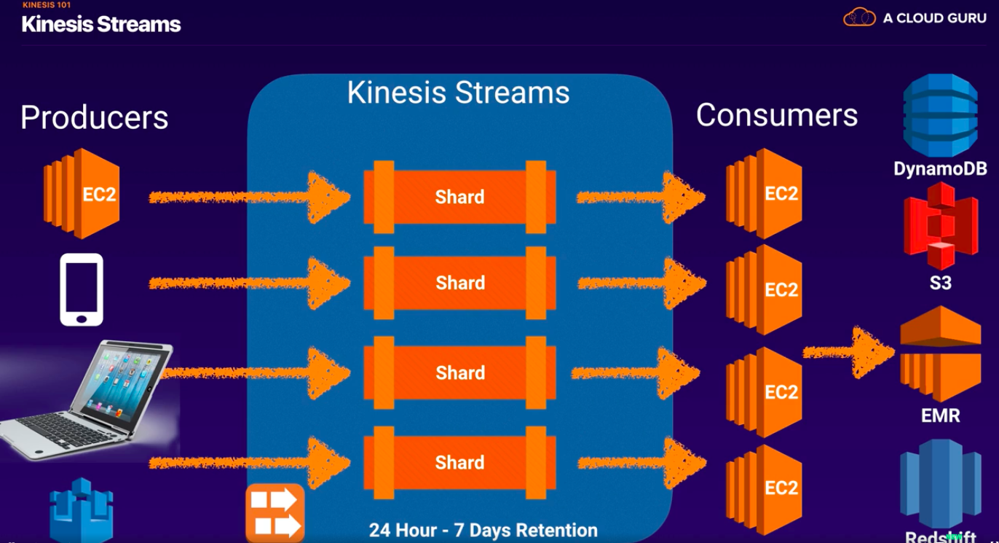

#### What Is Streaming Data?

Streaming Data is data that is generated continuously by thousands of data sources, which typically send in the data records simultaneously, and in small sizes (order of Kilobytes.)

> Purchases from online stores (think amazon.com)
> Stock Prices
> Game data (as the gamer plays)
> Social network data
> Geospatial data (think uber.com)


Firehose 

> Kind of consumes it right away. 


### Web Identity Federation & Cognito

### Quiz


## Serverless

#### Lambda Concepts

#### Let's Build A Serverless Webpage

#### Let's Build An Alexa Skill

#### Serverless Application Model (SAM)

### Elastic Container Service (ECS)

#### What is ECS


#### Components


- Cluster
  - Logical collection of ECS resources — either ECS EC2 instances or Fargate instances
- Task Definition
  - Defines your application. Similar to a Dockerfile but for running containers in ECS. Can contain multiple containers.
- Container Definition
  - Inside a task definition, it defines the individual containers a task uses. Controls CPU and memory allocation and port mappings.
- Task
  - Single running copy of any containers defined by a task definition. One working copy of an application (e.g., DB and web containers).
- Service
  - Allows task definitions to be scaled by adding tasks. Defines minimum and maximum values.
- Registry
  - Storage for container images (e.g., Elastic Container Registry (ECR) or Docker Hub). Used to download images to create containers.


#### Related topics

##### Containers and Docker


### QUIZ

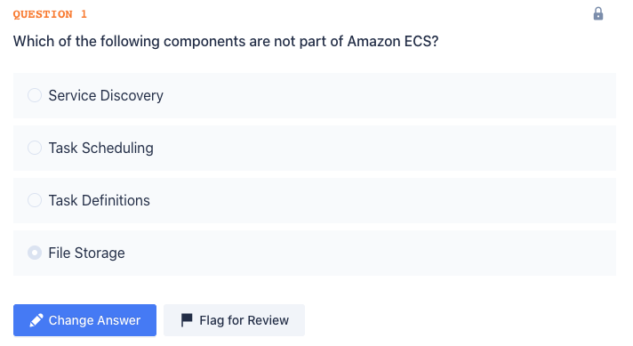


## Combined 

### Lightsail

Lightsail is an easy-to-use cloud platform that offers you everything needed to build an application or website, plus a cost-effective, monthly plan. Whether you’re new to the cloud or looking to get on the cloud quickly with AWS infrastructure you trust, we’ve got you covered.

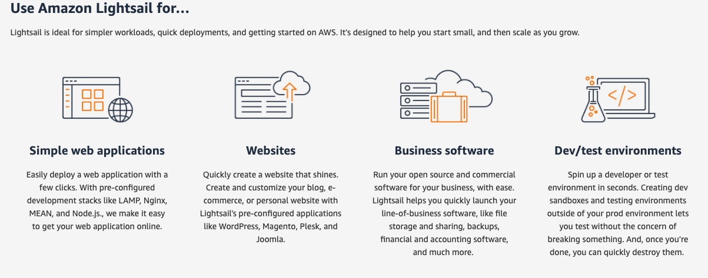


## overview/ biz

- Which AWS offering enables users to find, buy, and immediately start using software solutions in their AWS environment?  => AWS Marketplace

- Which service can identify the user that **made the API call** when an Amazon EC2 instance is terminated?  A) AWS Trusted Advisor B) __AWS CloudTrail __C) AWS X-Ray

  > AWS `CloudTrail` helps users enable **governance, compliance, and operational and risk auditing** of their AWS accounts. Actions taken by a user, role, or an AWS service are recorded as events in `CloudTrail`. Events include actions taken in the AWS Management Console, AWS Command Line Interface (CLI), and AWS SDKs and APIs.

- [AWS shared responsibility model]()

  - AWS responsibility __“Security of the Cloud”__
  - Customer responsibility __“Security in the Cloud”__

## Q&A

- what is store data `on-premise` ?

> On-**Premises Data Storage**
>
> The term "on **premises**" refers to local hardware, meaning **data** is **stored** on local servers, computers or other devices. For example, a company may purchase a server on which to **store data**. After buying the server, the company sets it up at their headquarters and uploads their **data**.